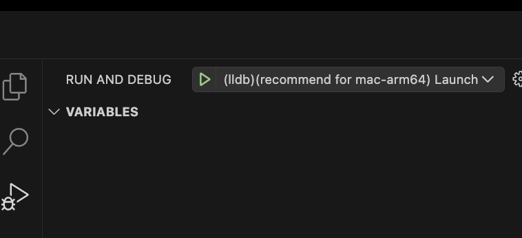

# Byeol VS Code development environment configuration

* Provides settings for debugging `byeol` programming interpreter with VS Code.

### Prerequisites

* You need the binary of `byeol`. Since you need to compile from the source code,
you need to have an envrionment where byeol can be built from
[byeol](https://github.com/byeol-org/byeol).
* I recommend installing the `C/C++` extension distributed by Microsoft for VS Code.

### How to install

* Copy the entire `.vscode` in the root folder to the root folder of the `byeol` project.
* After running `vs code`, open the root folder of the `byeol` project.
* Open the `Run and Debug` view and if you see a listbox next to `Start Debugging` at the top, you're good to go.

### Notes
* The default setting is gdb, but on mac-arm64 it should be lldb only.
